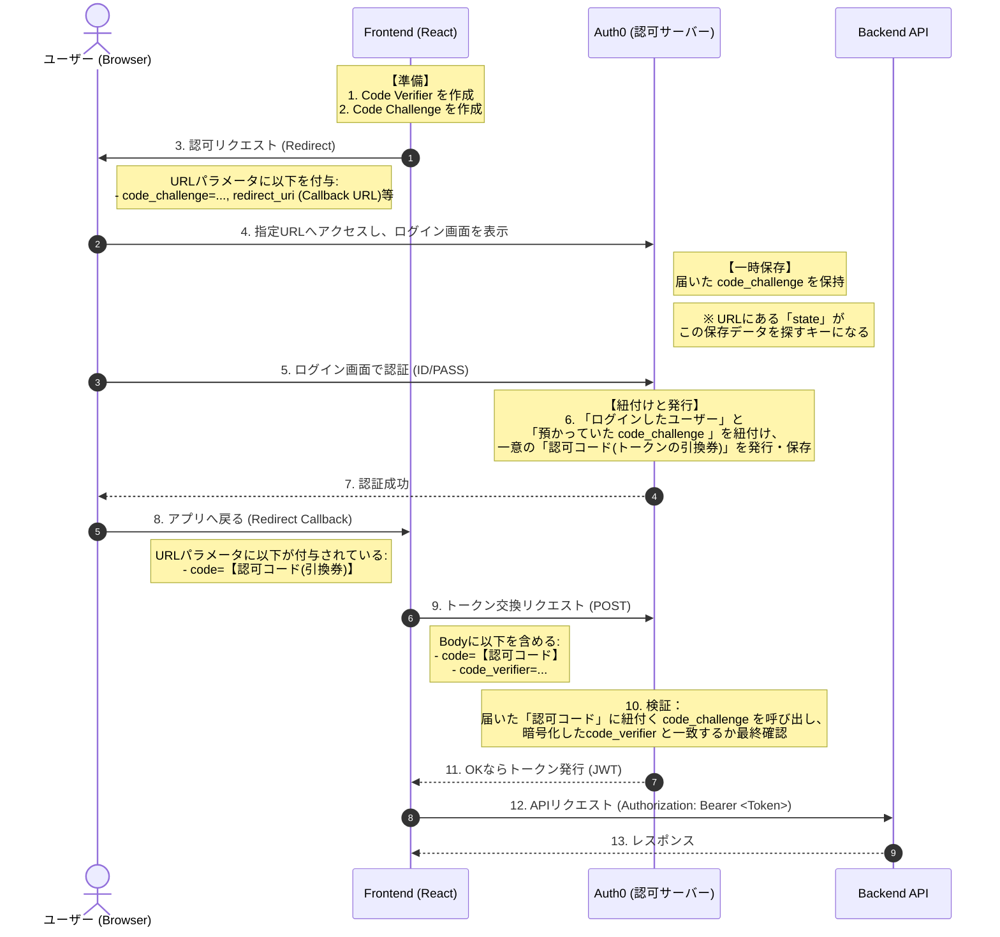
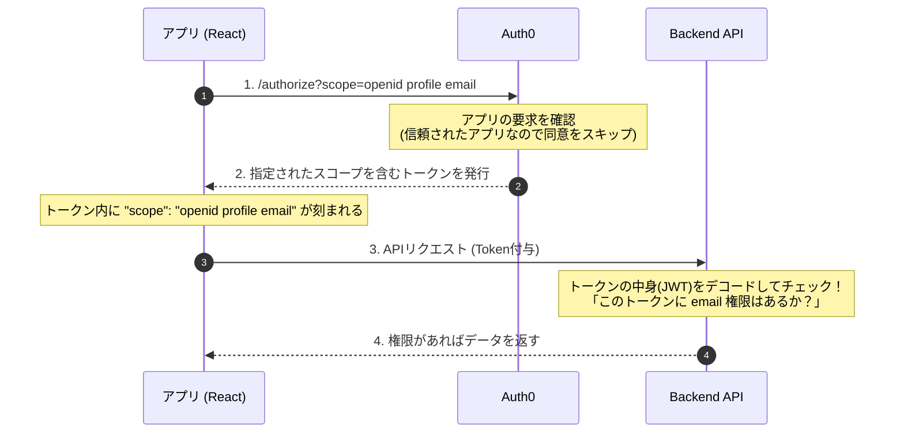

# Authorization Code Flow with PKCE

## Step 3: ユーザー認証の実装について学ぶ

---

## 1. 前回のおさらい：M2M (Client Credentials Flow)

- **仕組み**: サーバーが自分の「パスワード(Secret)」を直接Auth0に送ってトークンを得る
- **前提**: Secretを誰にも見られない安全な場所に隠せること（サーバーサイド限定）
- **今回の課題**: ブラウザ(React等)はソースコードが丸見え。Secretを隠す場所がない！

---

## 2. 決定的な違い：M2M vs ユーザー認証

| 特徴           | M2M (前回)                      | ユーザー認証 (今回)                 |
| :------------- | :------------------------------ | :---------------------------------- |
| **主体**       | プログラム                      | **人間 (行員・顧客)**               |
| **認証場所**   | アプリ内部                      | **認可サーバーの画面 (Redirect先)** |
| **秘密の保持** | 可能 (Client Secret)            | **不可能 (Public Client)**          |
| **安全性確保** | 固定パスワード（Client Secret） | **PKCE (動的な使い捨て合言葉)**     |

---

## PKCE とは？

PKCE: **Proof Key for Code Exchange** の略。
「Secretを使わずに、どうやって『今リクエスト送ってきたアプリは本物か？』を証明するか」という技術です。

ブラウザアプリ（SPA）には「Client Secret」を持たせられません。
もし、Client Secretをアプリに持たせ、それを途中で悪意のある第三者に盗まれたらどうなるでしょうか？

---

## なぜ PKCE が必要なのか？

- **問題**: 攻撃者がその Client Secret を使って、勝手にトークンを入手できてしまう。
- **解決策**: Client Secret の代わりに、Auth0が発行した**トークンの引換券（認可コード）**を利用する。
- **身分証明**: アプリは、引換券と身分証（Code Verifier）を提示することで、「その引換券を要求したのは、間違いなく**数秒前にログインを開始した本人**である」と証明する。

---

## 3. 登場する「2つの合言葉」

ブラウザアプリは、出発（リダイレクト）する直前に、自分だけが知る「使い捨ての合言葉」を生成します。

1. **Code Verifier**
   - ブラウザがその場で作る、ランダムな長い文字列。
   - **「最後」**にAuth0に提示するまで、ブラウザの中に隠しておく。
2. **Code Challenge**
   - Verifierをハッシュ化（SHA256）して作った文字列。
   - **「最初」**にログイン画面にリダイレクトする際、URLに含めて渡す。

---

## 4. PKCE 認証フローシーケンス

---

## 5. 実装の注意点：Callback URL

ユーザーがAuth0から戻ってくる場所（Redirect URI）は、**Auth0ダッシュボードで1文字も違わずに事前登録**する必要があります。

- **Allowed Callback URLs**: `http://localhost:3000`
- **Allowed Logout URLs**: `http://localhost:3000`
- **Allowed Web Origins**: `http://localhost:3000`

※ 登録がないと、Auth0はリダイレクト先を「偽サイト」と判断し、エラーになります。

---

## 6. まとめ

1. **出発**: ブラウザで Code Verifier を隠し、Code Challengeを持ってAuth0へ。
2. **認証**: Auth0の画面で安全にログイン。Auth0が「問題」と「引換券」を紐付ける。
3. **引換券**: 「認可コード（引換券）」を持ってアプリへ帰還。
4. **交換**: 「引換券」と Code Verifier を提示して、ようやく「トークン」をゲット。

「最初と最後に合言葉を確認する」からこそ、Secretがなくても安全なのです。

---

## 7. ハンズオン：ブラウザの裏側で「PKCEの合言葉」を確認しましょう。

[ハンズオン実行ガイド](https://github.com/tyamaguchi102088/study-oauth/tree/main/handson/authorization-code-flow/README.md)

---

## 8. スコープ（Scope）：ユーザー認証における「権限」の考え方

技術的な「仕組み（PKCE）」を理解したところで、最後に「何ができるか（権限）」を整理します。

### 1. スコープ（Scope）とは？

トークンという「通行証」に刻印された、「立ち入り許可エリア」のリストで、\
「あなたに代わって、アプリが何をしていいか」を定義するものです。

---

### 2. スコープの決定プロセス（3段階のフィルター）

最終的な権限は、以下の3つのフィルターによって決定されます。

1. **Request**: アプリ（app.js）が「これだけの権限が欲しい」と申請。
2. **Auth0 Setting**: 管理者がそのアプリに対して許可している範囲。
3. **User Consent (同意)**: **ユーザーが「見せていいよ」と承認した範囲。** \
   ※ユーザーが拒否した権限は、たとえアプリが要求してもトークンには入りません。

### 3. M2M との違い：誰の許可が必要か

- **M2M (前回)**:
  - アプリ（マシン）自体に付与された固定の権限。
- **Authorization Code Flow (今回)**:
  - アプリが「ユーザーに代わって」操作するための、**ユーザーによる期間限定の許可**。

---

## 9. スコープ（Scope）の答え合わせ：今回のハンズオンでは？

実際に皆さんが動かしたアプリで、裏側がどうなっていたかを確認します。

### 1. 今回要求したスコープ

アプリ（`app.js`）はAuth0に対し、以下の3つを要求しました。

- `openid`: 「OpenID Connectによる認証」の開始宣言
- `profile`: ユーザーの氏名・写真などの取得許可
- `email`: ユーザーのメールアドレスの取得許可

---

### 2. なぜ「同意画面」がスキップされたのか？

通常、第三者が作ったアプリなら「許可しますか？」という画面が出ますが、今回は出なかったはずです。

- **理由**: 皆さんが「テナントの所有者（管理者）」として、自分自身のアプリを動かしたため。
- **Auth0の仕様**: 「信頼された第1パーティアプリ」であれば、管理者が代行して同意しているとみなされ、ユーザーへの確認がスキップされます。

---

### 3. スコープの検証シーケンス

画面に出なくても、APIを叩く瞬間には厳密にチェックが行われています。

---

## 10. 補足：IDトークンの役割（認証 vs 認可）

今回のハンズオンでは「アクセストークン」を使ってAPIを叩きましたが、実はAuth0からはもう一つのトークン **「IDトークン」** も届いています。

### なぜIDトークンが必要なのか？

- **アクセストークン (認可)**: API（鍵穴）を開けるための **「鍵」** です。中身はAPIが読みます。
- **IDトークン (認証)**: ログインした人の名前やメールアドレスが書かれた **「身分証」** です。アプリが読みます。

### 今回のハンズオンでは？

- Auth0から発行はされていますが、アプリ側では使用せず「無視」しています。
- 実務で「画面右上にログインユーザー名を出したい」といった場合は、このIDトークンを読み取って利用します。
- **「誰であるかを確認する(IDトークン)」** と **「何ができるかを許可する(アクセストークン)」** を切り分けるのが現代のスタンダードです。

---

## 11. 最後に：安全なAPI連携のために

- **PKCE**: 「正しいアプリ」からのリクエストかを検証する（**なりすまし防止**）。
- **スコープ**: そのアプリに「どこまでの操作」を許すかを決定する（**過剰な権限付与の防止**）。

この2つが組み合わさることで、ブラウザという「秘密を守りにくい環境」でも、安全に認証・認可を行うことができるようになっています。

---

# お疲れ様でした！
