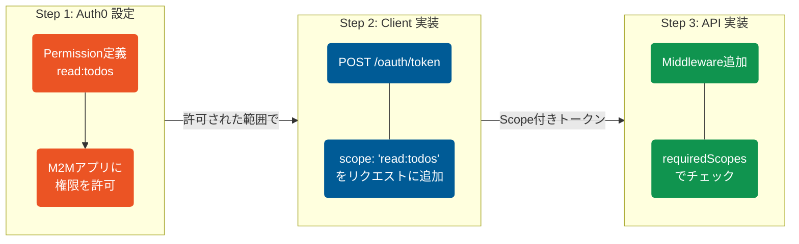
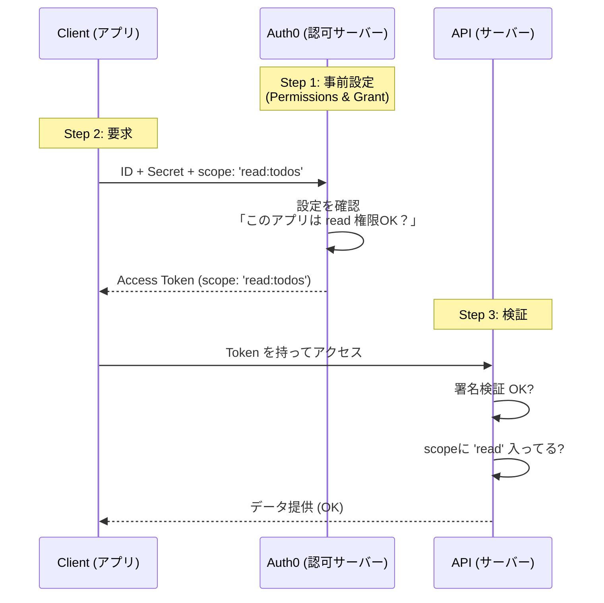

name: inverse
layout: true
class: center, middle, inverse

---

# Scope

## Step 2: Scope（スコープ）で権限を操る

---

layout: false

## 本日のゴール

1.  **「マスターキー」からの脱却**
    - 「何でもできるトークン」のリスクを理解する。
2.  **Scope（スコープ）の概念理解**
    - トークンに「できること」を書き込む仕組み。
3.  **ハンズオン実装**
    - 「読み取り専用」トークンを作り、書き込みリクエストを拒否させる。

---

## 現状の課題：マスターキー問題

前回、サーバー間通信の基本を学んだ際に取得したトークン（鍵）には、**権限の制限**がありませんでした。
鍵さえあれば、API に対して **「閲覧」も「作成」も「削除」も自由自在** です。

**リスクの例:**

- 「データの分析用（読むだけ）」のシステムに鍵を渡したい。
- もしその鍵が漏れたら、データが全て削除されるかもしれない。

👉 **「必要な権限だけを持った鍵」** を発行する必要があります。

---

## 解決策：Scope（スコープ）

**Scope = 「トークンに付与される権限のリスト」**

鍵（トークン）を発行する際、「これは閲覧専用 (`read:todos`) ですよ」という情報を焼き付けます。

- **従来のトークン:** 「入館証（全エリア OK）」
- **Scope 付きトークン:** 「入館証（**1F ロビーのみ**）」

API 側は、トークンの中身を見て「ここに入っていい権限があるか？」を追加でチェックします。

---

## 実装の 3 ステップ

Scope を機能させるには、3 者すべての変更が必要です。

1.  **Auth0 (認可サーバー):**
    - 「どんな権限が存在するか」を定義し、アプリに許可を与える。
2.  **Client (アプリ):**
    - トークンをもらう時に「`read:todos` の権限もください」とお願いする。
3.  **API (リソースサーバー):**
    - トークンの中身を見て、「`read:todos` が書いてあるか？」をチェックする。

---

## データの流れ

---

## 【ハンズオン】アプリ設定と実行

https://x.gd/6ijsw
上記ガイドに従ってアプリを実行してみてください

---

# お疲れ様でした！
