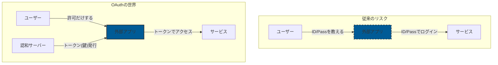
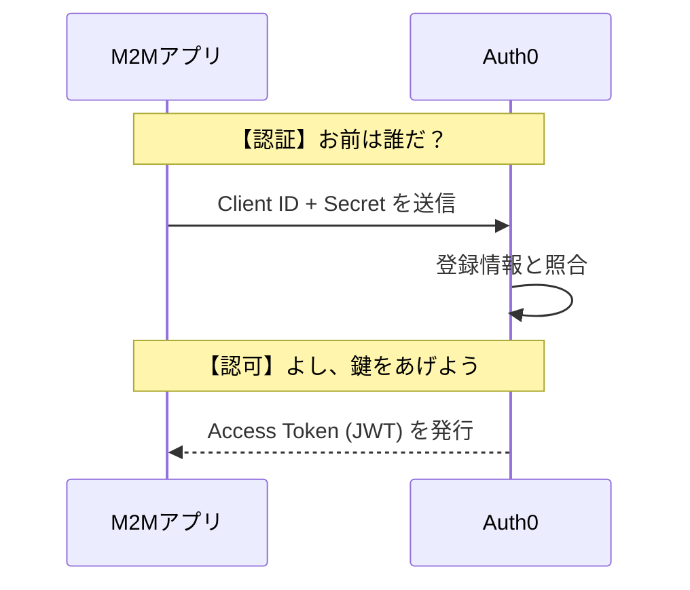
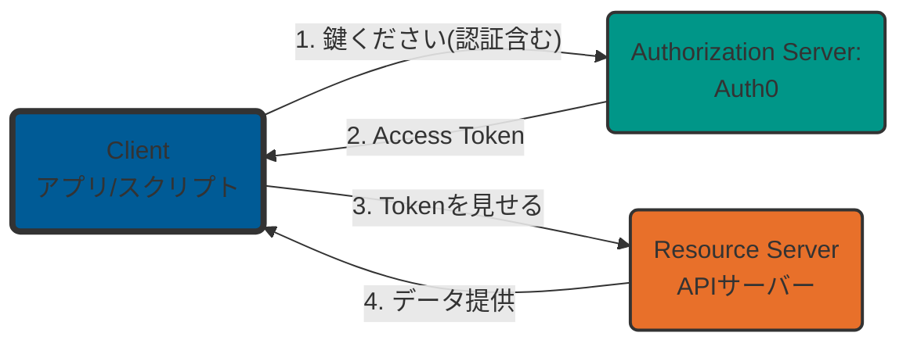
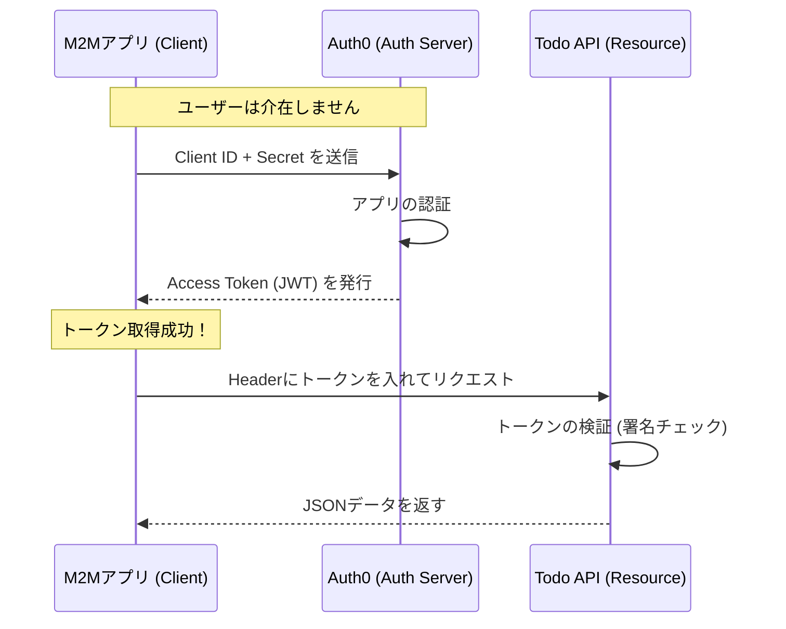
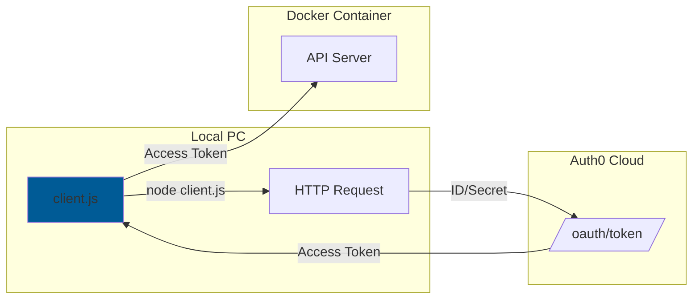
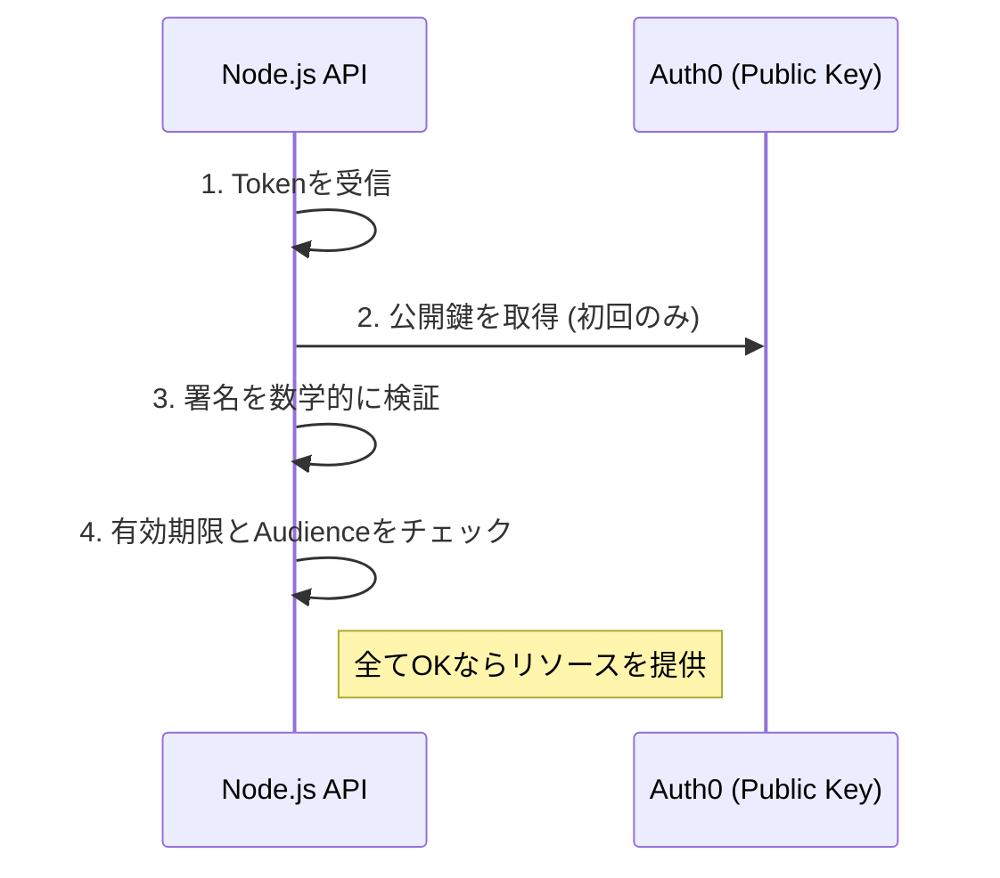

name: inverse
layout: true
class: center, middle, inverse

---

# Client Credential Flow ~

## Step 1: サーバー間通信の基本を学ぶ

layout: false

## 本日の内容

1. **OAuth 2.0 の全体像**
   - 「認証」と「認可」の違い
2. **システム間連携（Client Credentials Flow）**
   - ユーザーが介在しない M2M 通信の仕組み
3. **ハンズオン：Node.js スクリプトで API を叩く**
   - Auth0 の設定からトークン取得・検証まで
4. **【深掘り】技術解説**
   - JWT の構造と API サーバーでの検証ロジック

---

## OAuth 2.0 の全体像：なぜ「認可」なのか？

- **認証 (Authentication):** 「あなたは誰か？」を確認すること。
  - 例：免許証の提示、ID/パスワード入力
- **認可 (Authorization):** 「あなたに何を許可するか？」を決めること。
  - 例：ホテルのカードキー（特定の部屋への入室許可）

**OAuth は本来「認可」のフレームワークです。**
「身分証」を渡すのではなく、特定の権限を持った「通行証（トークン）」を扱うのが目的です。

---

## 利用シーンで選ぶ主要なフロー

「誰が」アクセスするのかによって、使うルートが変わります。

| フロー名                    | 主な対象               | シナリオ                                |
| :-------------------------- | :--------------------- | :-------------------------------------- |
| **Authorization Code Flow** | 人間 (User)            | Web サイトで「Google でログイン」する時 |
| **Client Credentials Flow** | **システム (Machine)** | **サーバー間のバッチ処理やデータ同期**  |

---

## なぜ OAuth が必要なのか？（スマートロックの例え）

**従来のやり方（パスワード共有）**

- 業者に「玄関のマスターキー」を渡すようなもの。
- **危険：** 合鍵を無くされたら？ 勝手に寝室に入られたら？

**OAuth のやり方（スマートロック）**

- 「掃除の時間だけ・リビングだけ入れるカードキー」を発行する。
- **安全：** 期限が来たら無効。権限（Scope）も限定できる。



---

## M2M における「認証」の正体

「カードキー（認可）」を渡す前の「本人確認（認証）」はどうなっているのか？

- **認証の主体：** 認可サーバー (Auth0)
- **認証の対象：** クライアントアプリ (皆さんの書くコード)
- **認証の手段：**
  - **Client ID:** マシンのユーザー名
  - **Client Secret:** マシンのパスワード（絶対に公開禁止）



---

## OAuth の登場人物（3 役）

1. **Resource Server (API):** データを持っている金庫。
2. **Client (App):** データを使いたいプログラム。
3. **Authorization Server:** Auth0（鍵を発行する窓口）。



---

## Client Credentials Flow とは

- **シナリオ:** ユーザー（人間）がいない「サーバー間通信」。
- **例:** 夜間バッチ処理、バックエンド間のデータ同期。
- **特徴:** Secret を使って直接トークンをもらう最短ルート。



---

## 【ハンズオン】準備と API 定義

**事前準備**
https://x.gd/1DNFn
上記ガイドの通りに Auth 0 の設定をします。

---

## 【ハンズオン】アプリ設定と実行

**\*実行ガイド**
https://x.gd/xMpTT
上記ガイドに従ってアプリを実行してみてください

ハンズオン概要



---

## トークンリクエストの裏側

`m2m-client` は Auth0 の `/oauth/token` に対し、以下の **HTTP POST** を送ります。

**Request Body (JSON):**

```json
{
  "client_id": "YOUR_CLIENT_ID",
  "client_secret": "YOUR_CLIENT_SECRET",
  "audience": "http://localhost:3001",
  "grant_type": "client_credentials"
}
```

- **grant_type:** 「ID/Secret で認証する」という宣言。
- **audience:** 「どの API（Identifier）を使いたいか」の指定。

---

## JWT (JSON Web Token) の正体

Access Token は **JWT** 形式です。
「.」で区切られた 3 つのブロックで構成されます。

### ① Header / ② Payload

誰が発行し、いつまで有効か、宛先はどこか。

### ③ Signature (署名)

改ざんを防止するためのデジタル署名。Auth0 の秘密鍵で作成されます。

---

## API サーバーでの検証ロジック

API サーバーは、届いたトークンを以下の手順で検証します。

1. **署名の検証:** Auth0 の公開鍵を取得し、署名が正しいか確認（改ざんチェック）。
2. **有効期限の確認:** `exp` を過ぎていないか。
3. **対象の確認:** `aud` (Audience) が自分の識別子と一致するか。



---

## まとめ：なぜ安全なのか？

- **機密情報の保護:** `Client Secret` はトークン取得時のみ使用。API との通信には「一時的なトークン」を使う。
- **改ざん検知:** JWT は数学的に改ざんを検知可能。
- **ステートレス:** サーバー側にセッションを保存する必要がなく、スケーラブル。

---

# お疲れ様でした！
